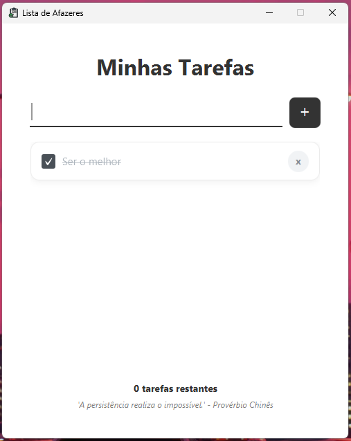

# Lista de Afazeres com JavaFX

## Sobre esse projeto 💡

Aplicação desktop de uma "Lista de Afazeres" (To-Do List) desenvolvida em Java e JavaFX. O projeto foi criado com o objetivo de aprimorar nossas habilidades na linguagem, especialmente no desenvolvimento de interfaces gráficas com JavaFX e na manipulação de banco de dados com SQLite.

#### <strong>Status: </strong>Concluído ✔️

## Funcionalidades 🚀
- [X] Adicionar novas tarefas à lista.
- [X] Marcar tarefas como concluídas.
- [X] Excluir tarefas da lista.
- [X] Persistência de dados: as tarefas ficam salvas mesmo após fechar o programa.

## Tecnologias utilizadas 💻

- [X] **Java**: Linguagem principal do projeto.
- [X] **JavaFX**: Framework para a criação da interface gráfica do usuário (GUI).
- [X] **SQLite**: Sistema de banco de dados leve para armazenar as tarefas localmente.
- [X] **Maven**: Ferramenta para gerenciamento de dependências e build do projeto.
- [X] **CSS**: Ferramenta para estilização do programa. 

## Aprendizados 🧠

Esse projeto foi um grande passo no nosso aprendizado em Java. O principal desafio foi criar uma aplicação desktop funcional que se conectasse a um banco de dados para garantir que os dados do usuário não fossem perdidos. Com o **JavaFX**, entendemos melhor como estruturar e controlar os elementos visuais de uma aplicação. Já o **SQLite** proporcionou a experiência de implementar a persistência de dados de forma simples e eficaz.

O projeto serviu para solidificar conceitos importantes de programação orientada a objetos, manipulação de dados, design de interfaces e arquiteura MVC, sendo fundamental para evolução na matéria de Linguagem de Programação.

## Autores

- Github - [@crestt0](https://github.com/crestt0/)
- Github - [@RodrigoCotrin](https://github.com/RodrigoCotrin)

***
